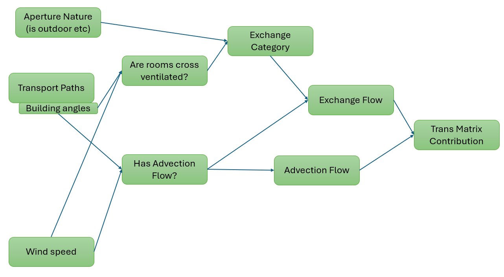
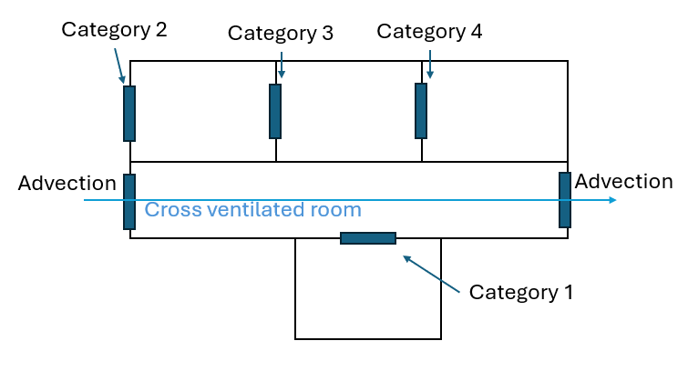

# Advection and Exchange flows

We depict the scheme used to determine the flow type here 

## Combining transport paths with wind

If we know the transport paths, know the wind speed and direction at a time, and know the orientation of the building then we can combine these to give a windspeed along each transport path.

This speed is assumed to flow through all the apertures along transport path.

If an aperture is involved in multiple transport paths, then their contributions are summed.

## Advection Flows

In the case where we have flow through an aperture, that aperture is said to have an advection flow.

### Flow magnitude

The advection flow goes from the upstream room to the downstream room only, leading to asymmetric motion of particles between the rooms.
The magnitude of the flow is then calculated using

+ The component of the wind through the aperture
+ The area of the aperture
+ Discharge coefficient of the aperture, this depends on how far along the transport path the aperture is
+ Pressure coefficients of the building
+ Density of the air

## Exchange Flows

Any open aperture without an advection flow is assumed to have some exchange flow.

### Categories

+ Rooms involved in any advection flow are said to be  **Cross ventilated**. Apertures that border a cross ventilated room, if they themselves are not involved in the flow, are called **Category 1**.
+ Apertures that join a room to the outside are labeled **Category 2**
+ Apertures that border rooms with apertures to the outside are labeled **Category 3** (costal rooms?)
+ Apertures that border 2 rooms with no outside aperture (landlocked rooms) and labeled **Category 4**

### Flow magnitude

The exchange flow goes in both directions equally.
The magnitude is not yet correctly defined.

+ Category 1  = 0.0
+ Category 2  = 0.0
+ Category 3  = 0.0
+ Category 4  = 0.0

These placeholder values will need to be changed to better reflect exchange flows.

## Aperture types 

## Trans matrix

These flows contribute to the trans matrix, which is in turn used to determine how concentrations of species change in response to the flow of particles between rooms.