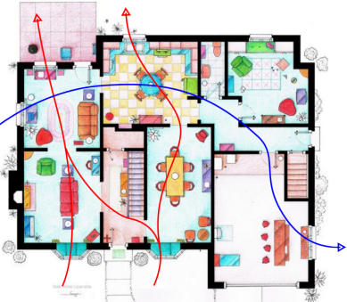
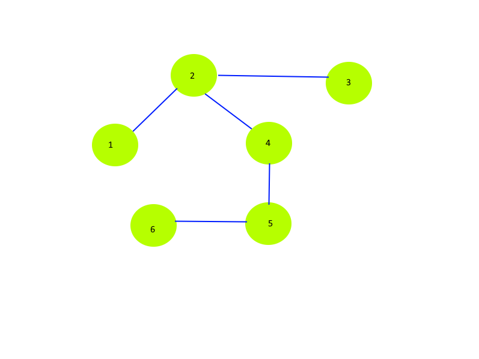

# Transport Paths

Transport paths describe a route through the building from one outside area to a different outside area (eg front to back).

These are the routes through which an airflow could go through rooms of the building. These can create the advection flows if combined with a wind.

## Deduction Algorithm

0) We start with:
    + A list of rooms
    + A list of apertures, each either joining 2 rooms, or connecting a room to the outside

1) We build a graph, where the nodes are the rooms, and the edges are those apertures between 2 rooms

2) We add 4 additional nodes for the left, right, front, and back of the building

3) Any apertures which connect to a single room act as edges between that room and one of the artificial nodes on the outside 

4) We perform depth-first-search on the graph, recording all the paths found from the node at the front of the house to the node at the back.
    + We exclude the left and right nodes to avoid paths which leave and re-enter the house
    + We prevent nodes being visited a second time in the path to avoid cycles

5) We repeat this 6 times, so as to deduce all the paths between the outside nodes
    + front-back
    + left-right
    + front-left
    + front-right
    + back-left
    + back-right

This process gives us all the paths between any 2 outside nodes

# Transport Path Directions

We combine the direction of the path (eg front to left) with the building direction to give each transport path its own direction.
The conventions for this are shown below.

Later this is compared with the wind direction to determine the windspeed **along** each path.